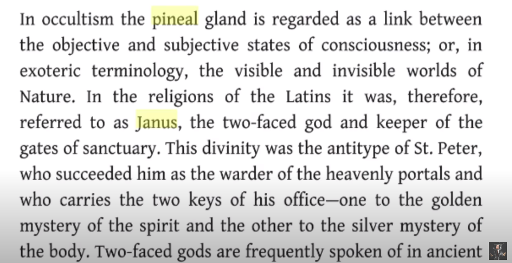

```
  _    _                           _   _                __     __             
 | |  | |                         | \ | |               \ \   / /             
 | |__| | __ _ _ __  _ __  _   _  |  \| | _____      __  \ \_/ /__  __ _ _ __ 
 |  __  |/ _` | '_ \| '_ \| | | | | . ` |/ _ \ \ /\ / /   \   / _ \/ _` | '__|
 | |  | | (_| | |_) | |_) | |_| | | |\  |  __/\ V  V /     | |  __/ (_| | |   
 |_|  |_|\__,_| .__/| .__/ \__, | |_| \_|\___| \_/\_/      |_|\___|\__,_|_|   
              | |   | |     __/ |                                             
              |_|   |_|    |___/   


─██████████████─██████████████─██████████████─██████████████─
─██░░░░░░░░░░██─██░░░░░░░░░░██─██░░░░░░░░░░██─██░░░░░░░░░░██─
─██████████░░██─██░░██████░░██─██████████░░██─██████████░░██─
─────────██░░██─██░░██──██░░██─────────██░░██─────────██░░██─
─██████████░░██─██░░██──██░░██─██████████░░██─██████████░░██─
─██░░░░░░░░░░██─██░░██──██░░██─██░░░░░░░░░░██─██░░░░░░░░░░██─
─██░░██████████─██░░██──██░░██─██░░██████████─██████████░░██─
─██░░██─────────██░░██──██░░██─██░░██─────────────────██░░██─
─██░░██████████─██░░██████░░██─██░░██████████─██████████░░██─
─██░░░░░░░░░░██─██░░░░░░░░░░██─██░░░░░░░░░░██─██░░░░░░░░░░██─
─██████████████─██████████████─██████████████─██████████████─

```

# Happy New Year 2023

**2022** | Last Year: https://github.com/praveendias1180/2022

# Janua (Latin)

Janua means 'a gate' or 'an opening' in Latin.

# Janus


## Janus | Januarius | Ianuarius | January 2023

Janus number is 11 and 65 and 300.. he is the calender. They moved the 11th month to be the first month.

https://www.youtube.com/watch?v=qNDchDJSq-E

# Janus | Brain | 2023




